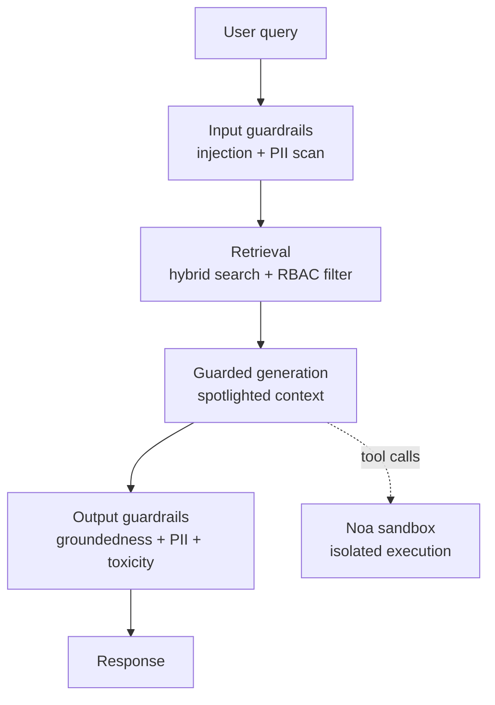

# RAG Security Guardrails

An internal knowledge-base chatbot built as a security engineering exercise, not a demo. The interesting part isn't the RAG — it's the four-stage guardrail pipeline that sits around it, and the fact that every claim below is measured, not asserted.

## Architecture



## Why guardrails, not just RAG

Most "RAG + security" projects bolt on a single filter and call it done. This one uses defense-in-depth: an input-stage classifier, retrieval-time authorization (not prompt-level), spotlighting to isolate untrusted document content from instructions, and an output-stage groundedness/PII check — each independently tested, each logged as a structured, auditable event.

See [`reports/threat_model.md`](reports/threat_model.md) for the full mapping to OWASP's 2025 LLM Top 10 and 2026 Agentic Top 10, including known limitations (documented honestly, not hidden).

## Stack

Python 3.12 / FastAPI · Qdrant (self-hosted) · Gemini API (free tier — `gemini-2.5-flash-lite`) · Microsoft Presidio · Next.js/Tailwind · Redis · Docker Compose

## Running it locally

```bash
docker compose up -d --build
```
Frontend: http://localhost:3000 · API docs: http://localhost:8000/docs

## Evaluation

Adversarial test set (`eval/adversarial_prompts.jsonl`) run against the live pipeline, measuring **attack defense rate** (blocked outright OR the injected instruction was safely ignored) rather than just block rate — since a model correctly ignoring an injected command is a valid defense even without an explicit block.

*(Results table — fill in once the full run completes)*

## What I'd do with more time

- Replace the LLM-as-judge groundedness check with an embedding-similarity check (lower cost, no external API dependency)
- Source hashing at ingestion to detect document tampering
- Route any agentic tool execution through [Krysta/Noa](https://krystawing.com), my own sandboxed execution environment, addressing OWASP's ASI02/ASI05 agentic risks directly